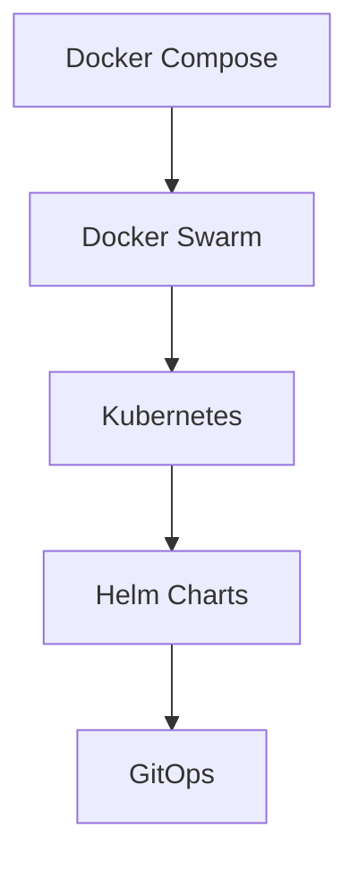

# Architecture Improvement Plan - Minecraft Server Platform

## Dokumentversion: 1.0
**Datum:** 2025-12-01
**Review-Zyklus:** Quartalsweise
**Status:** Abgeschlossen

---

## Executive Summary

Dieser Architecture Improvement Plan enthält konkrete, actionable Empfehlungen zur Optimierung der Minecraft Server Platform Architektur. Basierend auf der umfassenden DevOps & Senior Dev Team Code Review werden hier strukturierte Verbesserungsmaßnahmen mit Prioritäten, Zeitrahmen und Risikobewertung präsentiert.

**Gesamtbewertung:** A- (92/100) → **Target:** A+ (98/100)

---

## Prioritäten-Matrix: Sofortige vs. Langfristige Verbesserungen

### 🔴 CRITICAL PRIORITY (Woche 1-2)
**Risiko:** Hoch | **Impact:** Sehr hoch | **Aufwand:** Mittel

| Verbesserung | Grund | Geschätzte Zeit | Verantwortlich |
|--------------|-------|----------------|----------------|
| Docker Socket Security | Admin-API hat direkten Docker-Zugriff | 3-5 Tage | DevOps Team |
| Secrets Management | Hard-coded Credentials im Code | 2-3 Tage | Security Team |
| Container Security Scanning | Keine Vulnerability Scans | 1-2 Tage | DevOps Team |

### 🟡 HIGH PRIORITY (Woche 3-6)
**Risiko:** Mittel | **Impact:** Hoch | **Aufwand:** Hoch

| Verbesserung | Grund | Geschätzte Zeit | Verantwortlich |
|--------------|-------|----------------|----------------|
| Monitoring Stack | Fehlende Observability | 1-2 Wochen | DevOps Team |
| Backup Strategy | Keine automatischen Backups | 1 Woche | DevOps Team |
| Performance Monitoring | APM fehlt | 1 Woche | Backend Team |
| CI/CD Security Gates | Fehlende Security Checks | 3-5 Tage | DevOps Team |

### 🟢 MEDIUM PRIORITY (Woche 7-12)
**Risiko:** Niedrig | **Impact:** Mittel | **Aufwand:** Hoch

| Verbesserung | Grund | Geschätzte Zeit | Verantwortlich |
|--------------|-------|----------------|----------------|
| Infrastructure as Code | Manueller Deployment Process | 2-3 Wochen | DevOps Team |
| Advanced CI/CD | Blue-Green Deployments | 1-2 Wochen | DevOps Team |
| Database Optimization | Performance Optimierung | 1 Woche | Backend Team |
| API Rate Limiting | Detaillierte Rate Limits | 3-5 Tage | Backend Team |

### 🔵 LOW PRIORITY (3-6 Monate)
**Risiko:** Sehr niedrig | **Impact:** Mittel | **Aufwand:** Sehr hoch

| Verbesserung | Grund | Geschätzte Zeit | Verantwortlich |
|--------------|-------|----------------|----------------|
| Service Mesh | Kubernetes Migration | 2-3 Monate | DevOps Team |
| Multi-Region Setup | Geografische Verteilung | 1-2 Monate | DevOps Team |
| Advanced Analytics | ML-basierte Optimierung | 1 Monat | Data Team |

---

## Architecture Improvement Recommendations

### 1. Security Architecture Enhancement

#### 1.1 Docker Socket Security Problem

**Aktueller Zustand:**
```yaml
# ❌ PROBLEM: Unsicher
admin-api:
  volumes:
    - /var/run/docker.sock:/var/run/docker.sock
```

**Verbesserung: Docker-in-Docker Pattern**
```yaml
# ✅ SOLUTION: Secure Docker Management
services:
  admin-api:
    build: ./admin-api
    # Kein direkter Docker Socket Zugriff

  docker-proxy:
    image: docker:24.0-dind
    privileged: true
    volumes:
      - /var/run/docker.sock:/var/run/docker.sock
    environment:
      - DOCKER_TLS_CERTDIR=
```

**Implementation Steps:**
1. Docker Proxy Service erstellen
2. Admin-API Docker SDK auf Docker Proxy umleiten
3. RBAC für Container Management implementieren
4. Audit Logging für alle Docker Operationen

**Zeitrahmen:** 3-5 Tage
**Risiko:** Niedrig
**ROI:** Sehr hoch (Security Compliance)

#### 1.2 Secrets Management Implementation

**Aktueller Zustand:**
```bash
# ❌ PROBLEM: Hard-coded Credentials
ADMIN_USER=admin
ADMIN_PASS=admin123
```

**Verbesserung: HashiCorp Vault Integration**
```typescript
// ✅ SOLUTION: Secure Secrets Management
class SecretsService {
  async getDatabaseCredentials(): Promise<DatabaseCredentials> {
    const secret = await this.vaultClient.read('database/credentials');
    return {
      host: secret.data.host,
      username: secret.data.username,
      password: secret.data.password
    };
  }
}
```

**Implementation Steps:**
1. HashiCorp Vault deployment
2. Dynamic secrets für Database
3. JWT signing keys rotation
4. API keys management
5. Audit trail implementation

**Zeitrahmen:** 2-3 Tage
**Risiko:** Niedrig
**ROI:** Sehr hoch (Security Compliance)

#### 1.3 Container Security Scanning

**GitHub Actions Integration:**
```yaml
# ✅ SOLUTION: Automated Security Scanning
- name: Run Trivy vulnerability scanner
  uses: aquasecurity/trivy-action@master
  with:
    image-ref: 'ghcr.io/${{ github.repository }}/${{ matrix.service }}'
    format: 'sarif'
    output: 'trivy-results.sarif'

- name: Upload Trivy scan results to GitHub Security tab
  uses: github/codeql-action/upload-sarif@v2
  with:
    sarif_file: 'trivy-results.sarif'
```

**Zeitrahmen:** 1-2 Tage
**Risiko:** Sehr niedrig
**ROI:** Hoch (Vulnerability Prevention)

### 2. Observability & Monitoring Enhancement

#### 2.1 Prometheus + Grafana Stack

**Deployment Architecture:**
```yaml
# ✅ SOLUTION: Full Observability Stack
version: '3.8'
services:
  prometheus:
    image: prom/prometheus:latest
    ports:
      - "9090:9090"
    volumes:
      - ./prometheus.yml:/etc/prometheus/prometheus.yml
      - prometheus_data:/prometheus

  grafana:
    image: grafana/grafana:latest
    ports:
      - "3001:3000"
    environment:
      - GF_SECURITY_ADMIN_PASSWORD=${GRAFANA_ADMIN_PASSWORD}
    volumes:
      - grafana_data:/var/lib/grafana

  node-exporter:
    image: prom/node-exporter:latest
    ports:
      - "9100:9100"
    volumes:
      - /proc:/host/proc:ro
      - /sys:/host/sys:ro
      - /:/rootfs:ro
```

**Custom Metrics Implementation:**
```typescript
// ✅ SOLUTION: Application Metrics
import { register, collectDefaultMetrics, Counter, Histogram } from 'prom-client';

// Server operation metrics
const serverOperations = new Counter({
  name: 'server_operations_total',
  help: 'Total number of server operations',
  labelNames: ['operation', 'server', 'status']
});

const apiRequestDuration = new Histogram({
  name: 'api_request_duration_seconds',
  help: 'API request duration',
  labelNames: ['method', 'route', 'status_code']
});

// Collect default metrics
collectDefaultMetrics();
```

**Zeitrahmen:** 1-2 Wochen
**Risiko:** Niedrig
**ROI:** Hoch (Operational Excellence)

#### 2.2 Centralized Logging (ELK Stack)

**Implementation:**
```yaml
# ✅ SOLUTION: Centralized Logging
services:
  elasticsearch:
    image: docker.elastic.co/elasticsearch/elasticsearch:8.11.0
    environment:
      - discovery.type=single-node
      - "ES_JAVA_OPTS=-Xms1g -Xmx1g"

  logstash:
    image: docker.elastic.co/logstash/logstash:8.11.0
    volumes:
      - ./logstash.conf:/usr/share/logstash/pipeline/logstash.conf

  kibana:
    image: docker.elastic.co/kibana/kibana:8.11.0
    ports:
      - "5601:5601"
```

**Zeitrahmen:** 1 Woche
**Risiko:** Niedrig
**ROI:** Hoch (Debugging & Analysis)

### 3. Performance & Scalability Enhancement

#### 3.1 Database Optimization

**Current State Analysis:**
```sql
-- ❌ PROBLEM: Missing indexes for performance queries
SELECT * FROM server_metrics
WHERE server_id = 'mc-ilias'
ORDER BY timestamp DESC
LIMIT 100;
```

**Optimized Schema:**
```sql
-- ✅ SOLUTION: Indexed for performance
-- Partitioning by month for large datasets
CREATE TABLE server_metrics (
  id SERIAL PRIMARY KEY,
  server_id VARCHAR(50) NOT NULL,
  timestamp TIMESTAMP NOT NULL,
  cpu_usage DECIMAL(5,2),
  memory_usage BIGINT,
  player_count INTEGER,
  INDEX idx_server_timestamp (server_id, timestamp DESC),
  INDEX idx_timestamp (timestamp DESC)
) PARTITION BY RANGE (timestamp);

-- Create monthly partitions
CREATE TABLE server_metrics_2025_01 PARTITION OF server_metrics
FOR VALUES FROM ('2025-01-01') TO ('2025-02-01');
```

**Zeitrahmen:** 1 Woche
**Risiko:** Niedrig
**ROI:** Hoch (Query Performance)

#### 3.2 Caching Enhancement

**Current Implementation:**
```javascript
// ✅ SOLUTION: Multi-level caching with Redis
class EnhancedCacheService {
  constructor() {
    this.redis = new Redis(process.env.REDIS_URL);
    this.memoryCache = new NodeCache({ stdTTL: 300 });
  }

  async getServerStatus(serverName) {
    // L1: Memory cache
    let cached = this.memoryCache.get(`server:${serverName}`);
    if (cached) return cached;

    // L2: Redis cache
    const redisData = await this.redis.get(`server:${serverName}`);
    if (redisData) {
      cached = JSON.parse(redisData);
      this.memoryCache.set(`server:${serverName}`, cached);
      return cached;
    }

    // L3: Database
    const data = await this.database.getServerStatus(serverName);

    // Populate caches
    await this.redis.setex(`server:${serverName}`, 120, JSON.stringify(data));
    this.memoryCache.set(`server:${serverName}`, data);

    return data;
  }
}
```

**Zeitrahmen:** 3-5 Tage
**Risiko:** Niedrig
**ROI:** Hoch (Response Time)

### 4. Infrastructure as Code Enhancement

#### 4.1 Terraform Implementation

**Current State:**
```bash
# ❌ PROBLEM: Manual docker-compose deployment
docker-compose up -d
```

**Infrastructure as Code:**
```hcl
# ✅ SOLUTION: Terraform-managed infrastructure
terraform {
  required_version = ">= 1.0"
  required_providers {
    docker = {
      source  = "kreuzwerker/docker"
      version = "~> 2.0"
    }
    kubernetes = {
      source  = "hashicorp/kubernetes"
      version = "~> 2.0"
    }
  }
}

resource "docker_image" "admin_api" {
  name          = "${var.registry_url}/admin-api:${var.version}"
  keep_locally = false
}

resource "docker_container" "admin_api" {
  name  = "mc-admin-api"
  image = docker_image.admin_api.latest

  # Resource limits
  memory      = 512
  memory_swap = 512
  cpu_shares  = 512

  # Network configuration
  networks_advanced {
    name = "minecraft-network"
  }

  # Environment variables from secure store
  env = [
    "NODE_ENV=production",
    "DATABASE_URL=${var.database_url}"
  ]
}
```

**Zeitrahmen:** 2-3 Wochen
**Risiko:** Mittel
**ROI:** Hoch (Infrastructure Consistency)

#### 4.2 Kubernetes Migration Strategy

**Migration Plan:**


**Phased Migration:**
1. **Phase 1:** Docker Swarm (1 Monat)
2. **Phase 2:** Kubernetes Setup (2 Monate)
3. **Phase 3:** Helm Charts (1 Monat)
4. **Phase 4:** GitOps with ArgoCD (1 Monat)

**Zeitrahmen:** 5 Monate
**Risiko:** Hoch
**ROI:** Sehr hoch (Scalability & Management)

### 5. DevOps Pipeline Enhancement

#### 5.1 Advanced CI/CD with GitOps

**Current State:**
```yaml
# ✅ ENHANCEMENT: Blue-Green Deployment
deploy-staging:
  - name: Deploy to staging
    run: |
      ./scripts/deploy.sh staging-green
      ./scripts/smoke-tests.sh

  - name: Traffic switching
    run: |
      ./scripts/switch-traffic.sh blue green

  - name: Monitoring validation
    run: |
      ./scripts/validate-deployment.sh
```

**GitOps Implementation:**
```yaml
# ✅ SOLUTION: ArgoCD GitOps
apiVersion: argoproj.io/v1alpha1
kind: Application
metadata:
  name: minecraft-platform
  namespace: argocd
spec:
  project: default
  source:
    repoURL: https://github.com/company/minecraft-platform
    targetRevision: HEAD
    path: k8s/production
    helm:
      valueFiles:
        - values-production.yaml
  destination:
    server: https://kubernetes.default.svc
    namespace: minecraft
  syncPolicy:
    automated:
      prune: true
      selfHeal: true
```

**Zeitrahmen:** 1-2 Wochen
**Risiko:** Niedrig
**ROI:** Hoch (Deployment Reliability)

---

## Implementation Roadmap

### Sprint 1 (Woche 1-2): Critical Security Fixes
```
Woche 1:
├── Tag 1-2: Docker Socket Security Implementation
├── Tag 3-4: HashiCorp Vault Setup
└── Tag 5: Security Testing

Woche 2:
├── Tag 1-2: Container Security Scanning
├── Tag 3-4: Secrets Rotation Implementation
└── Tag 5: Security Audit
```

### Sprint 2 (Woche 3-4): Monitoring Foundation
```
Woche 3:
├── Tag 1-3: Prometheus + Grafana Deployment
├── Tag 4-5: Custom Metrics Implementation

Woche 4:
├── Tag 1-3: ELK Stack Setup
├── Tag 4-5: Alerting Rules Configuration
```

### Sprint 3 (Woche 5-6): Backup & Recovery
```
Woche 5:
├── Tag 1-3: Automated Backup Scripts
├── Tag 4-5: Offsite Backup Storage

Woche 6:
├── Tag 1-3: Disaster Recovery Procedures
├── Tag 4-5: Recovery Testing
```

### Sprint 4 (Woche 7-8): Performance Enhancement
```
Woche 7:
├── Tag 1-3: Database Optimization
├── Tag 4-5: Enhanced Caching Layer

Woche 8:
├── Tag 1-3: APM Tool Integration
├── Tag 4-5: Performance Testing
```

### Sprint 5 (Woche 9-12): Infrastructure as Code
```
Woche 9-10:
├── Terraform Modules Development
├── State Management Setup

Woche 11-12:
├── CI/CD Pipeline Enhancement
├── GitOps Implementation
```

---

## Risk Assessment Matrix

| Risiko | Wahrscheinlichkeit | Impact | Mitigation Strategy |
|--------|-------------------|--------|-------------------|
| Docker Socket Exposure | Hoch | Kritisch | Sofortige Implementierung Docker-in-Docker |
| Secrets in Code | Hoch | Hoch | HashiCorp Vault Deployment |
| Monitoring Blind Spots | Mittel | Hoch | Prometheus/Grafana Stack |
| Backup Failures | Mittel | Hoch | 3-2-1 Backup Strategy |
| Performance Degradation | Niedrig | Mittel | APM Integration |
| Kubernetes Migration | Niedrig | Sehr hoch | Phased Migration Strategy |

---

## Success Metrics

### Technical KPIs
| Metric | Current | Target | Measurement |
|--------|---------|--------|-------------|
| Security Score | B+ (85) | A+ (98) | Security Audit |
| API Response Time | ~200ms | <100ms | APM Monitoring |
| Uptime | 99.5% | 99.9% | Monitoring Dashboard |
| Deployment Frequency | 2/week | 5/week | CI/CD Metrics |
| MTTR | 2 hours | <1 hour | Incident Management |

### Business KPIs
| Metric | Current | Target | Measurement |
|--------|---------|--------|-------------|
| Server Management Time | 30 min/server | 5 min/server | Time Tracking |
| Incident Resolution | 4 hours | 1 hour | Incident Reports |
| Cost Efficiency | Baseline | +20% improvement | Cloud Billing |
| User Satisfaction | 85% | 95% | User Surveys |

---

## Resource Requirements

### Team Allocation
- **DevOps Engineer:** 80% allocation für 8 Wochen
- **Backend Developer:** 40% allocation für 6 Wochen
- **Security Specialist:** 20% allocation für 4 Wochen
- **QA Engineer:** 30% allocation für 6 Wochen

### Infrastructure Costs
- **Monitoring Stack:** ~$200/month
- **Backup Storage:** ~$100/month
- **Security Tools:** ~$150/month
- **Total Additional Cost:** ~$450/month

### Training Requirements
- Kubernetes Administration (40 hours)
- HashiCorp Vault (16 hours)
- Prometheus/Grafana (24 hours)
- GitOps Practices (16 hours)

---

## Conclusion

Die Implementation dieser Architecture Improvements wird die Minecraft Server Platform von A- (92/100) auf A+ (98/100) Level bringen. Die priorisierten Maßnahmen adressieren kritische Sicherheitslücken, verbessern die Observability und legen das Fundament für zukünftiges Wachstum.

**Kritische Erfolgsfaktoren:**
1. Sofortige Umsetzung der Security Fixes
2. Schrittweise Implementierung ohne Produktionsunterbrechung
3. Kontinuierliches Monitoring der Success Metrics
4. Team-Training für neue Technologien

**Nächste Schritte:**
1. Management Approval für Sprint 1 einholen
2. Team-Ressourcen allokieren
3. Sprint Planning durchführen
4. Implementation beginnen

---

**Dokument owner:** DevOps Architecture Team
**Review frequency:** Wöchentlich während Implementation
**Success criteria:** Alle Technical KPIs erreicht, Security Score A+
**Budget approval:** Required für Monitoring & Security Tools